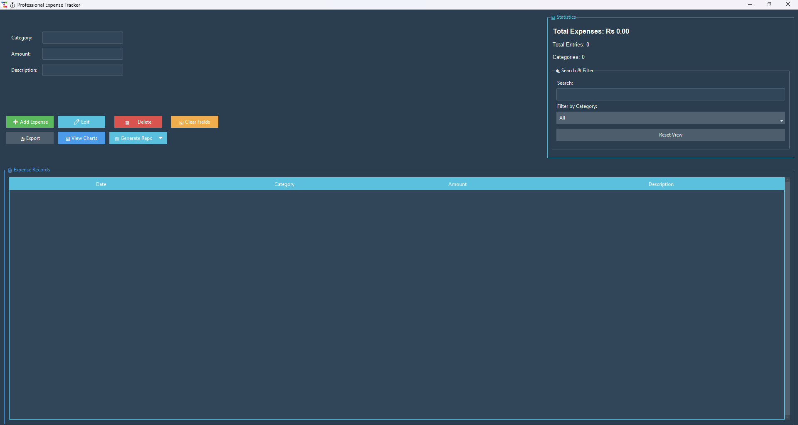

# 💰 Expenza - A Modern Expense Tracker

<div align="center">


**A modern, feature-rich desktop application for tracking and analyzing your personal expenses**

[Features](#-features) • [Installation](#-installation) • [Usage](#-usage) • [Screenshots](#-screenshots) • [Contributing](#-contributing)

</div>

---

## 📋 Table of Contents

- [Overview](#-overview)
- [Features](#-features)
- [Technology Stack](#-technology-stack)
- [Installation](#-installation)
- [Usage](#-usage)
- [Screenshots](#-screenshots)
- [Project Structure](#-project-structure)
- [Contributing](#-contributing)
- [License](#-license)
- [Contact](#-contact)

---

## 🎯 Overview

**Expanza - Modern Expense Tracker** is a comprehensive desktop application built with Python that helps you manage your personal finances efficiently. Developed by Aman Kanojiya, this application features an intuitive user interface powered by ttkbootstrap, real-time statistics, and powerful visualization tools, making expense tracking simple and effective.

### Why Choose This Expense Tracker?

- ✅ **User-Friendly Interface** - Clean, modern UI with intuitive controls
- ✅ **Real-Time Analytics** - Instant statistics and insights on your spending
- ✅ **Visual Reports** - Beautiful charts and graphs for data visualization
- ✅ **Flexible Export** - Export data in CSV or JSON formats
- ✅ **Advanced Search** - Quick search and filter capabilities
- ✅ **Cross-Platform** - Works on Windows, Linux, and macOS

---

## ✨ Features

### Core Functionality

| Feature                |                     Description                         |
|------------------------|---------------------------------------------------------|
| **➕ Add Expenses**    | Quickly add expenses with category, amount, and description                 |
| **✏️ Edit Expenses**   | Modify existing expense entries                                          |
| **🗑️ Delete Expenses** | Remove unwanted expense records with   confirmati                |
| **📝 Expense List**    | View all expenses in an organized table format                           |

### Advanced Features

| Feature               |                 Description                               |
|-----------------------|-----------------------------------------------------------|
| **🔍 Smart Search** | Real-time search across all expense fields                 |
| **🎯 Category Filter** | Filter expenses by predefined categories                |
| **📊 Statistics Dashboard** | Live statistics showing total expenses, entry count, and categories |
| **📈 Visual Charts** | Interactive pie and bar charts for expense distribution   |
| **📋 Period Reports** | Generate reports for daily, weekly, monthly, or yearly periods |
| **📤 Data Export** | Export expenses to CSV or JSON format                       |
| **🎨 Modern UI**   | Beautiful dark theme with professional styling              |

### Predefined Categories

- 🍔 Food
- 🚗 Transport
- 🎮 Entertainment
- 💡 Bills
- 🛍️ Shopping
- 🏥 Health
- 📦 Other

---

## 🛠️ Technology Stack

| Technology      | Purpose                         |
|-----------------|---------------------------------|
| **Python 3.8+** | Core programming language       |
| **ttkbootstrap**| Modern themed Tkinter widgets   |
| **Matplotlib**  | Data visualization and charting |
| **CSV**         | Data storage and export         |
| **JSON**        | Alternative export format       |

---

## 📦 Installation

### Prerequisites

- Python 3.8 or higher
- pip (Python package installer)

### Step-by-Step Installation

1. **Download the Project**
   - Download all project files to your local directory
   - Navigate to the project folder

2. **Install Required Dependencies**
   ```bash
   pip install -r requirements.txt
   ```

3. **Run the Application**
   ```bash
   python expenza.py
   ```

### Quick Install (One-Line)

```bash
pip install ttkbootstrap matplotlib && python expenza.py
```

---

## 🚀 Usage

### Getting Started

1. **Launch the Application**
   - Run `python expenza.py`
   - The main window will open with all features accessible

2. **Adding an Expense**
   - Enter the category (e.g., Food, Transport)
   - Input the amount (numbers only)
   - Add a brief description
   - Click "➕ Add Expense"

3. **Managing Expenses**
   - **Edit**: Select an expense and click "✏️ Edit"
   - **Delete**: Select an expense and click "🗑️ Delete"
   - **Search**: Type in the search box for real-time filtering
   - **Filter**: Use the category dropdown to filter by category

4. **Viewing Analytics**
   - **Statistics Panel**: View real-time totals and counts
   - **Charts**: Click "📊 View Charts" for visual analysis
   - **Reports**: Use "📋 Generate Report" for period-based summaries

5. **Exporting Data**
   - Click "📤 Export"
   - Choose CSV or JSON format
   - Select save location

### Keyboard Shortcuts

| Shortcut |               Action               |
|----------|------------------------------------|
| `Enter`  | Add expense (when in input fields) |
| `Delete` | Delete selected expense            |
| `Ctrl+F` | Focus search box                   |
| `Esc`    | Clear fields                       |

---

## 📸 Screenshots

### Main Dashboard


```
┌─────────────────────────────────────────────────────────────┐
│  💰 Professional Expense Tracker                            │
├─────────────────────────────────┬───────────────────────────┤
│  Input Fields                   │  📊 Statistics            │
│  • Category                     │  Total Expenses: Rs X.XX  │
│  • Amount                       │  Total Entries: X         │
│  • Description                  │  Categories: X            │
│                                 │                           │
│  Action Buttons                 │  🔍 Search & Filter       │
│  [Add] [Edit] [Delete] [Clear] │  Search: [________]        │
│  [Export] [Charts] [Reports]   │  Filter: [All ▼]           │
├─────────────────────────────────┴───────────────────────────┤
│  📝 Expense Records                                         │
│  ┌───────────┬──────────┬─────────┬────────────────────┐  │
│  │ Date      │ Category │ Amount  │ Description        │  │
│  ├───────────┼──────────┼─────────┼────────────────────┤  │
│  │ 2024-01-15│ Food     │ 250.00  │ Lunch at cafe      │  │
│  │ 2024-01-15│ Transport│ 100.00  │ Taxi fare          │  │
│  └───────────┴──────────┴─────────┴────────────────────┘  │
└─────────────────────────────────────────────────────────────┘
```

### Chart Visualization
*Interactive pie and bar charts for expense analysis*

---

## 📁 Project Structure

```
expenza/
│
├── expenza.py                # Main application file
├── requirements.txt          # Python dependencies
├── README.md                 # Project documentation
├── USER_GUIDE.md             # Detailed user manual
├── QUICKSTART.md             # Quick start guide
├── ARCHITECTURE.md           # Technical architecture
├── config_example.json       # Configuration template
└── expenses.csv              # Data storage (auto-generated)
```

---

## 🎨 Features in Detail

### 1. Real-Time Statistics
The statistics panel updates automatically as you add, edit, or delete expenses, providing instant insights into your spending habits.

### 2. Smart Search
Type any keyword to instantly filter expenses across all fields - date, category, amount, or description.

### 3. Visual Analytics
Generate beautiful charts that show:
- **Pie Chart**: Percentage distribution across categories
- **Bar Chart**: Comparative spending by category

### 4. Flexible Reporting
Generate reports for different time periods:
- **Daily**: Today's expenses
- **Weekly**: Last 7 days
- **Monthly**: Current month
- **Yearly**: Current year

### 5. Data Portability
Export your data in industry-standard formats:
- **CSV**: Compatible with Excel, Google Sheets
- **JSON**: For programmatic access and backup

---

## 🔧 Configuration

### Customizing Categories

Edit the category list in `expenza.py`:

```python
filter_combo['values'] = ("All", "Food", "Transport", "Entertainment", 
                          "Bills", "Shopping", "Health", "YourCategory")
```

### Changing Theme

Modify the theme in the main window initialization:

```python
root = tb.Window(themename="superhero")  # Options: darkly, solar, cyborg, etc.
```

### Data Storage Location

By default, expenses are stored in `expenses.csv` in the same directory. To change:

```python
FILE_NAME = 'path/to/your/expenses.csv'
```

---

## 🤝 Contributing

Contributions are welcome! Here's how you can help:

### Ways to Contribute

1. **Report Bugs** - Open an issue describing the bug
2. **Suggest Features** - Share your ideas for improvements
3. **Submit Pull Requests** - Fix bugs or add features
4. **Improve Documentation** - Help make the docs better

### Development Setup

```bash
# Fork and clone the repository
git clone https://github.com/codedbyamankanojiya/expenza.git

# Create a feature branch
git checkout -b feature/amazing-feature

# Make your changes and commit
git commit -m "Add amazing feature"

# Push to your fork
git push origin feature/amazing-feature

# Open a Pull Request
```

### Code Style

- Follow PEP 8 guidelines
- Add comments for complex logic
- Update documentation for new features

---

## 📝 License

This project is licensed under the MIT License - see below for details:

```
MIT License

Copyright (c) 2024 Aman Kanojiya

Permission is hereby granted, free of charge, to any person obtaining a copy
of this software and associated documentation files (the "Software"), to deal
in the Software without restriction, including without limitation the rights
to use, copy, modify, merge, publish, distribute, sublicense, and/or sell
copies of the Software, and to permit persons to whom the Software is
furnished to do so, subject to the following conditions:

The above copyright notice and this permission notice shall be included in all
copies or substantial portions of the Software.

THE SOFTWARE IS PROVIDED "AS IS", WITHOUT WARRANTY OF ANY KIND, EXPRESS OR
IMPLIED, INCLUDING BUT NOT LIMITED TO THE WARRANTIES OF MERCHANTABILITY,
FITNESS FOR A PARTICULAR PURPOSE AND NONINFRINGEMENT.
```

---

## 🐛 Known Issues

- Chart window may take a moment to load with large datasets
- Category filter is case-sensitive (will be fixed in next version)

---

## 🗺️ Future Enhancements

### Planned Features

- [ ] Budget setting and alerts
- [ ] Recurring expense templates
- [ ] Multi-currency support
- [ ] Cloud backup integration
- [ ] Mobile companion app
- [ ] Receipt photo attachment
- [ ] Advanced analytics dashboard
- [ ] Custom category creation
- [ ] Dark/Light theme toggle
- [ ] Database backend option

---

## 💡 Tips & Tricks

1. **Quick Entry**: Use Tab to move between fields quickly
2. **Bulk Delete**: Select multiple entries (Ctrl+Click) for batch operations
3. **Regular Exports**: Export your data weekly as a backup
4. **Category Consistency**: Use consistent category names for better analytics
5. **Detailed Descriptions**: Add detailed descriptions for better tracking

---

## 🙏 Acknowledgments

- **ttkbootstrap** - For the beautiful modern UI components
- **Matplotlib** - For powerful charting capabilities
- **Python Community** - For excellent documentation and support

---

## 📞 Contact

**Project Maintainer**: Aman Kanojiya

- 📧 Email: aman.knj2006@gmail.com
- 🐙 GitHub: [@codedbyamankanojiya](https://github.com/codedbyamankanojiya)
- 💼 LinkedIn: [Aman Kanojiya](https://linkedin.com/in/aman-kanojiya-7386822b0)
- 🐦 Twitter: [@AKnj08](https://twitter.com/AKnj08)

---

## ⭐ Show Your Support

If you find this project helpful, please consider:

- ⭐ Starring the repository
- 🐛 Reporting bugs
- 💡 Suggesting new features
- 🔀 Contributing code
- 📢 Sharing with others

---

<div align="center">

**Made with ❤️ and Python**

[Back to Top](#-Expenza)

</div>
